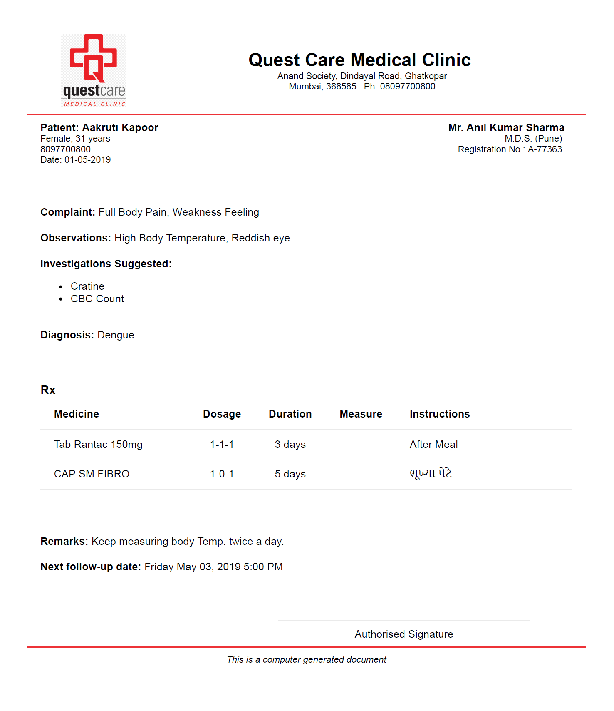
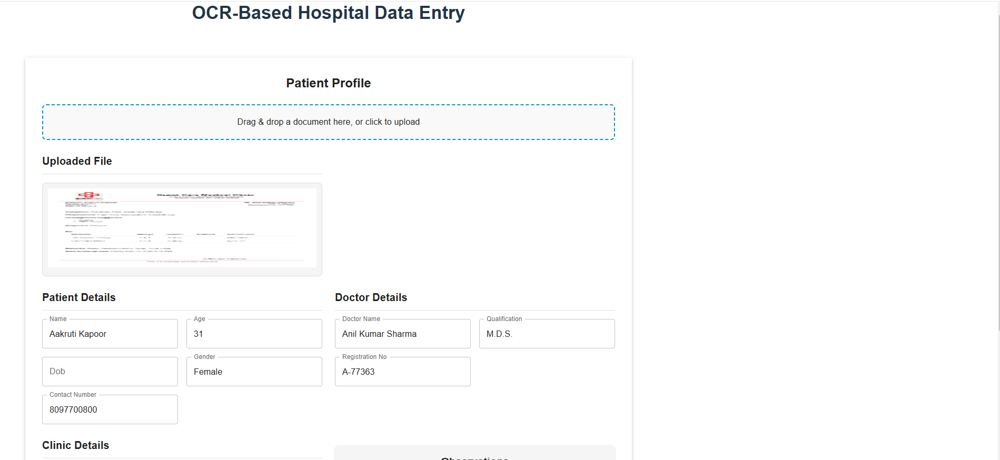
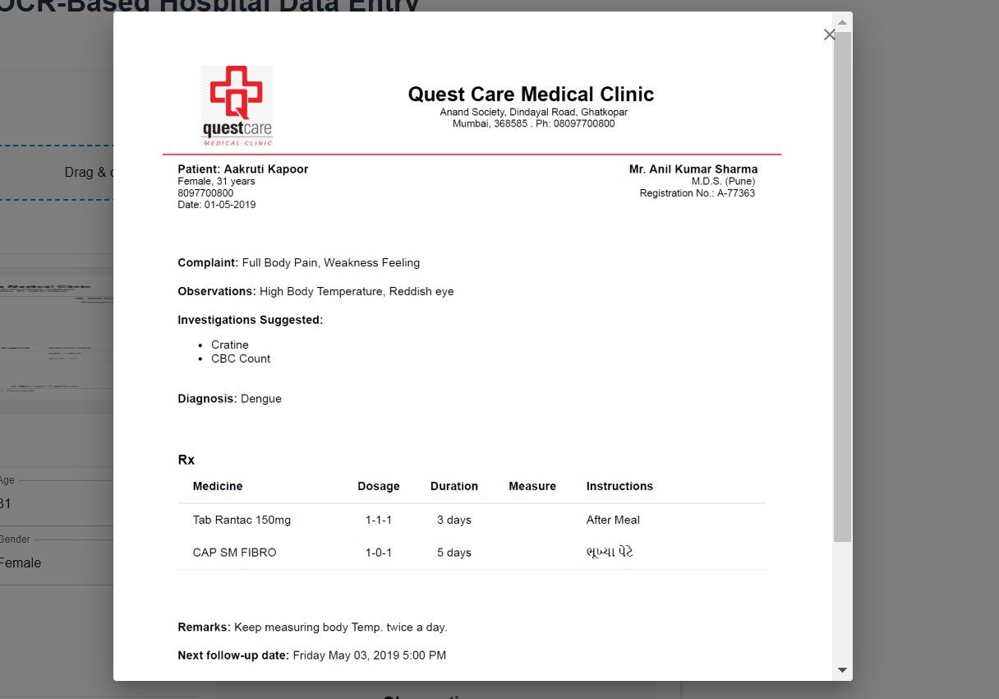

# 🏥 Patient Profile OCR Automation

This project automates hospital data entry using **OCR (Optical Character Recognition)** and **AI-powered NLP (Natural Language Processing)**. It extracts patient details, doctor information, clinic details, and medical observations from uploaded images or PDFs.

To enhance **data accuracy and insights**, we integrate **Google Gemini**, an AI-powered NLP model, to analyze extracted text and derive structured information.

---

## 🚀 Features

- ✅ **Upload Images/PDFs** – Drag & Drop support for easy file selection.
- 🔍 **OCR Extraction (Tesseract OCR)** – Extracts raw text from images and PDFs.
- 🧠 **AI-Powered Insights (Google Gemini)** – NLP model processes OCR results to extract structured data.
- 📋 **Observations & Diagnosis** – Extracted medical notes displayed in structured cards.
- 📷 **File Preview** – Users can preview uploaded images or PDFs before processing.
- 🖼 **Full-Screen View** – Click on the preview to open it in a full-screen modal.
- 🎭 **Snackbar Notification** – Success toast notification after successful processing.
- ⏳ **Loading Indicator** – Displays a progress bar while processing.
- 🧹 **Clear Form** – Button to reset all extracted data.

---

## 🏗 How It Works

### 1️⃣ **OCR (Optical Character Recognition) with Tesseract**

- **Tesseract.js** is used to extract text from images or PDFs.
- OCR works well for digitized text but struggles with understanding context.

### 2️⃣ **AI-Powered NLP Insights with Google Gemini**

- **OCR alone is not enough** – it extracts text but lacks contextual understanding.
- We use **Google Gemini**, an NLP model, to analyze the extracted text.
- Gemini helps:
  - Identify **patient details** (Name, Age, DOB, Gender, Contact).
  - Extract **doctor and clinic details** from unstructured text.
  - Recognize **observations & medical diagnosis** intelligently.

### 3️⃣ **Data Structuring & UI Presentation**

- The processed data is displayed in structured fields and observation cards.
- Users can review, edit, and save the extracted details.

---

## 📦 Tech Stack

- **Frontend**: React, Material UI
- **Backend**: Node.js, Express.js
- **OCR Engine**: Tesseract.js
- **AI/NLP**: Google Gemini API
- **Styling**: Material UI Components

---

## 🛠 Setup & Installation

### 1️⃣ Clone the Repository

```bash
git clone https://github.com/your-repo/patient-profile-ocr.git
cd patient-profile-ocr
```

### 2️⃣ Install Dependencies

```bash
npm install
```

### 3️⃣ Start the Development Server

```bash
npm start
```

The app will be available at **http://localhost:3000**

---

## 📌 How to Use

1. **Upload an image or PDF** (containing patient details, prescriptions, or medical forms).
2. **OCR extracts raw text** from the document.
3. **Google Gemini NLP processes** the extracted text and identifies structured details.
4. **View extracted details** (Patient, doctor, and clinic details are automatically filled).
5. **Check Observations & Diagnosis** (Medical observations are displayed in structured cards).
6. **Preview the uploaded file** (Click on the thumbnail to view it in full-screen mode).
7. **Save Profile or Clear Data** (Use action buttons to save or reset the form).

---

## 📷 UI Screenshots

| File Upload                               | Extracted Data                                      | File Preview                                    |
| ----------------------------------------- | --------------------------------------------------- | ----------------------------------------------- |
|  |  |  |

---

## 🛠 Future Enhancements

- 🌐 **API Integration** – Connect extracted data to a hospital database.
- 📊 **Analytics Dashboard** – View trends in patient data.
- 🏥 **Multi-File Upload Support** – Process multiple documents in one go.
- 🔎 **Enhanced OCR Accuracy** – Use AI-based text recognition for better accuracy.

---

👨‍💻 **Developed by:** _Abhishek Rathore_
